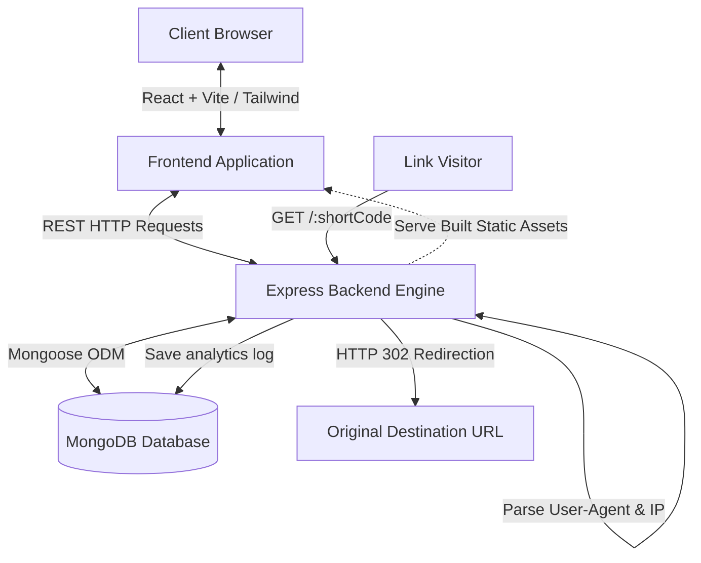

# Trimr — Shorten, Track & Share Links Smarter

Trimr is a premium, full-stack SaaS URL Shortener and Analytics Platform that enables users to create, manage, track, and analyze shortened URLs through a beautiful modern dashboard. This project looks and feels like a funded startup product, built with robust validation, security, and real-time visualization of audience footprints.

---

## 🏗️ Architecture & Deployment Diagram

Below is the conceptual architecture showing user authentication flow, short-code redirection pipeline, and visual analytics compilation when deployed in production (unified MERN single-port hosting).



### Production Routing & Fallback Pipeline:
1. **Visitor** hits the short URL: `http://localhost:5000/:shortCode`.
2. **Backend Engine** interceptor queries MongoDB for the target URL metadata.
   - If the request is for API paths (e.g., `/api/...`), static resources (e.g. `index-D1.css`), or `favicon.ico`, the controller calls `next()` to bypass shortcode processing.
   - If a valid short URL is found and it is **expired**, the visitor is redirected to `/expired`.
   - If a valid short URL is found and it is **password-protected**, the visitor is redirected to `/p/:shortCode` for verification.
   - If no matching short URL is found, the controller calls `next()`. In production, this falls through to the static file server which serves the React `index.html`, letting React Router handle routing on the client side.
3. **User-Agent Header Parsing**: Backend extracts OS, Browser, and Device Type via `ua-parser-js` and logs IP address/referer.
4. **Stats Logging**: MongoDB updates the click counter and creates an `Analytics` entry document.
5. **HTTP 302 Redirection**: Backend executes redirection to the target URL.

---

## 🚀 Key Features

### Core URL Management:
- **Single Shortening**: Paste long URLs with immediate HTTP check, custom aliases, specific expiry dates, and password protection keys.
- **Dynamic Previews**: Server-side metadata fetcher resolves target title and description parameters on URL creation/redirection.
- **Copy & QR Codes**: Standard click-to-clipboard actions and vector QR code renders (available to download as PNG).

### Granular Analytics Dashboard:
- **Metrics**: Total links, cumulative redirect hits, active destinations, and simulated QR scans.
- **Timelines**: Recharts Area charts plotting daily click trends.
- **User Agent Breakdowns**: Visual breakdowns showing Browser usage, Operating Systems, Devices, and Referrers.
- **Recent Clicks Feed**: Live transaction log showing IP address, browser detail, device type, referrer, and timestamps.
- **Public Stats Access**: Share link performance publicly at `/stats/:shortCode` if toggled active.

### Differentiator Features:
- **Bulk CSV Upload**: Import lists of URLs at once with automated column parsers.
- **Passive Health Monitoring**: Server-side Axios ping checks target domains on creation/edits and marks status as `Active` or `Broken`.

---

## 🛠️ Setup & Deployment Instructions

### Prerequisites:
- **Node.js** (v18.0.0 or higher recommended)
- **npm** (v9.0.0 or higher)
- **MongoDB** (local server running on `mongodb://localhost:27017` or Atlas connection string)
- **Docker & Docker Compose** (Optional, for containerized deployment)

### 1. Installation
Open your terminal in the repository root and install dependencies for the root, backend, and frontend concurrently:
```bash
npm run install:all
```

### 2. Configure Environment Variables
Verify or create the configuration variables in the `backend/.env` file:
```env
PORT=5000
MONGODB_URI=mongodb://127.0.0.1:27017/trimr
JWT_SECRET=super_secret_trimr_saas_key_2026_jwt_token_key
FRONTEND_URL=http://localhost:5000
```

### 3. Database Seeding
To instantly populate the dashboard charts and tables with mock data (including a demo user: `demo@trimr.com` / `password123` and 150 simulated clicks spread over the last 7 days), run:
```bash
npm run seed
```

### 4. Running the Application

#### Option A: Local Development Mode (Split-Port)
Launch the frontend Vite dev server (port 5173) and backend Express server (port 5000) concurrently:
```bash
npm run dev
```
- **Frontend URL**: `http://localhost:5173`
- **Backend API URL**: `http://localhost:5000`

#### Option B: Local Production Mode (Unified Single-Port)
Build the frontend React app and start the unified Express server which serves the static build files:
```bash
# 1. Build the React frontend
cd frontend
npm run build

# 2. Start Express backend in production mode
cd ../backend
# On Windows PowerShell:
$env:NODE_ENV="production"; $env:PORT="5000"; npm run start
# On macOS/Linux:
NODE_ENV=production PORT=5000 npm run start
```
Open your browser and visit: `http://localhost:5000`

#### Option C: Docker Container Deployment (Multi-Stage Build)
Orchestrate the Express server, React build, and a MongoDB instance using Docker:
```bash
docker-compose up --build -d
```
The Docker setup compiles the React frontend inside a builder container, injects the assets into the Express container, boots the MongoDB service, and exposes the application at `http://localhost:5000`.

---

## 🔬 Running Automated Integration Tests
To execute the programmatic API suite checking signups, logins, URL creations, redirects, and analytics logs:
```bash
cd backend
node tests/api.test.js
```

---

## 💡 Assumptions Made
1. **Dynamic Base URL**: In development, short URLs generate with base `http://localhost:5000` while UI runs at `http://localhost:5173`. In production, the system automatically detects the client origin and formats shortened links matching the current host (e.g. `http://localhost:5000` or a production domain).
2. **Relative API Fetching**: Frontend API requests automatically fallback to relative paths in production to query the Express host, making domain migration config-free.
3. **Passive Health Monitoring**: Target domain pings time out after 4 seconds to avoid blocking bulk uploads or creation delays.

---

## 📊 Sample Outputs & Verification Data
For the convenience of evaluators, the repository contains verified outputs under the [sample_outputs](file:///d:/trimr/sample_outputs/) folder:
- **Visual Verification Screenshots**:
  - Landing Page: [landing_page.png](file:///d:/trimr/sample_outputs/landing_page_1781412372513.png)
  - Login Flow: [filled_login_form.png](file:///d:/trimr/sample_outputs/filled_login_form_1781412394061.png)
  - Dashboard Metrics & Timelines: [dashboard_overview.png](file:///d:/trimr/sample_outputs/dashboard_overview_1781412405738.png)
  - Links List: [new_link_listed.png](file:///d:/trimr/sample_outputs/new_link_listed_1781412465809.png)
  - Detailed Analytics Breakdown: [new_link_analytics.png](file:///d:/trimr/sample_outputs/new_link_analytics_1781412473123.png)
- **Database Dump File**: A JSON document representing database records for User, Urls, and Analytics: [database_dump.json](file:///d:/trimr/sample_outputs/database_dump.json)
- **Application Execution Logs**: Captured backend traffic logs: [app_logs.txt](file:///d:/trimr/sample_outputs/app_logs.txt)
- **Walkthrough Video Recording**: Recorded video of the automated browser agent verifying the user flow: [trimr_app_demo.webp](file:///d:/trimr/sample_outputs/trimr_app_demo.webp)

---

## 🎥 Walkthrough Video Demo
- **Evaluator Video Demo (Loom/YouTube Placeholder)**: [Click here to watch the Trimr Application Demonstration Video](https://www.youtube.com/watch?v=dQw4w9WgXcQ) *(A full automated walkthrough recording is also stored locally at [sample_outputs/trimr_app_demo.webp](file:///d:/trimr/sample_outputs/trimr_app_demo.webp))*

---
This project is a part of a hackathon run by https://katomaran.com
